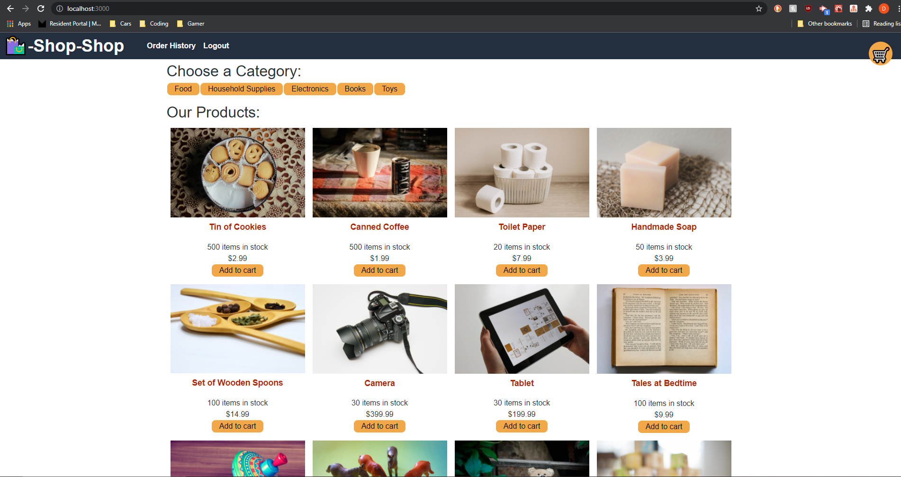
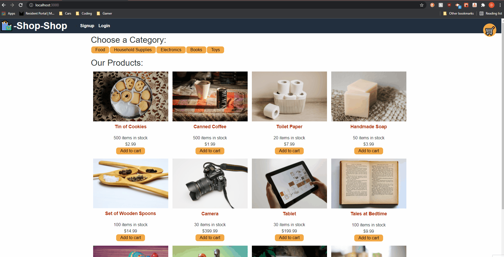

# Redux Store
## Table of Contents
- [Description](#Description)
- [Deployment](#live)
- [Installation](#installation)
- [Usage](#usage)
- [Technologies Used](#tech)
- [Questions / Contacts](#Contacts)

## Description
An eccomerce app refactored to use redux instead of Context API. 

## Live
Live Deployment: 

## Installation

First you'll clone the repo then you'll run the following lines into your terminal.
`npm i` to install all packages in client and server
`npm run seed` in server
`npm start` in server and client, application will run on localhost:3000

## Usage

Signup or login at the top of the page. Browse products and click them to open background information. Add them to cart with add to cart button, remove from cart with remove button. You can only checkout if you're logged in. Checkout takes you to stripe page to complete payment info.

## Tech
React, Redux, Stripe, bcrypt, Mongoose, Express, node.js, Apollo, GraphQL and JSON Web Token

## Contact

For enquiries contact me at dcbarstow7@gmail.com

To see other projects, please visit <https://github.com/DylanBarstow7/>